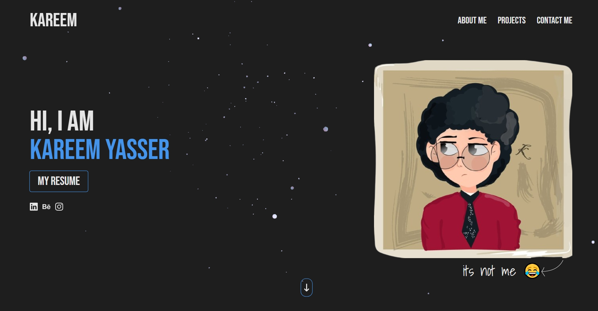

# Kareem Yasser's Portfolio Website

Welcome to Kareem's interactive portfolio! This project showcases professional skills and projects with modern web technologies and smooth animations.

---

## 🚀 **Live Preview**

Explore the live version: [Kareem's Portfolio](https://kareem-portfolio-one.vercel.app/)

---

## 🛠️ **Technologies Used**

### **Core Stack**

- **Vite** (v6.1.0): Next-generation frontend tooling
- **React** (v19.0.0): JavaScript library for building UIs
- **TypeScript** (v5.7.2): Static type checking
- **Tailwind CSS** (v3.4.17): Utility-first CSS framework

### **3D & Animations**

- **OGL** (v1.0.11): WebGL graphics library
- **GSAP** (v3.12.7): Professional-grade animations
  - `@gsap/react` (v2.1.2): React integration

### **UI & UX**

- **Lenis** (v1.1.20): Smooth scrolling
- **React Icons** (v5.4.0): Comprehensive icon library

### **CMS & Content**

- **Sanity.io**: Headless CMS
  - `@sanity/client` (v6.27.2): Sanity client
  - `@sanity/image-url` (v1.1.0): Image optimization

### **Email Services**

- **EmailJS** (v4.4.1): Email automation

---

## 📂 **Project Structure**

```plaintext
portfolio/
├── public/          # Static assets
├── src/
│   ├── components/  # Reusable components
│   ├── pages/       # Application pages
│   ├── utils/       # Utilities and helpers
├── package.json
├── tailwind.config.js
└── tsconfig.json
```

---

## App Screenshot



---

## ⚙️ **Scripts**

Run these scripts to manage the project:

- `npm run dev` - Start the development server.
- `npm run build` - Build the production-ready version of the site.
- `npm run start` - Start the production server.
- `npm run lint` - Run linting for the codebase.

---

## 🌟 **Key Features**

- Modern 3D elements with OGL

- Smooth scroll animations using Lenis

- Professional animations with GSAP

- Contact form integration with EmailJS

- CMS-powered content with Sanity.io

- Responsive design with Tailwind CSS

- Type-safe development with TypeScript

---

## 🎬 Demo

You can try out the live demo of the My portfolio application here:  
[My portfolio Demo](https://kareem-portfolio-one.vercel.app/)

---

## 📜 **License**

This project is licensed under the MIT License. See the [LICENSE](LICENSE) file for details.

---

## 👤 **Credits**

**Developed by: [Adel Yasser](https://github.com/dola5xd)**  
**Portfolio Owner: Kareem Yasser**

---

## 📧 **Contact**

For development inquiries:
**dolay6253@gmail.com**

Contact portfolio owner:
**kareemyasserg6@gmail.com**
